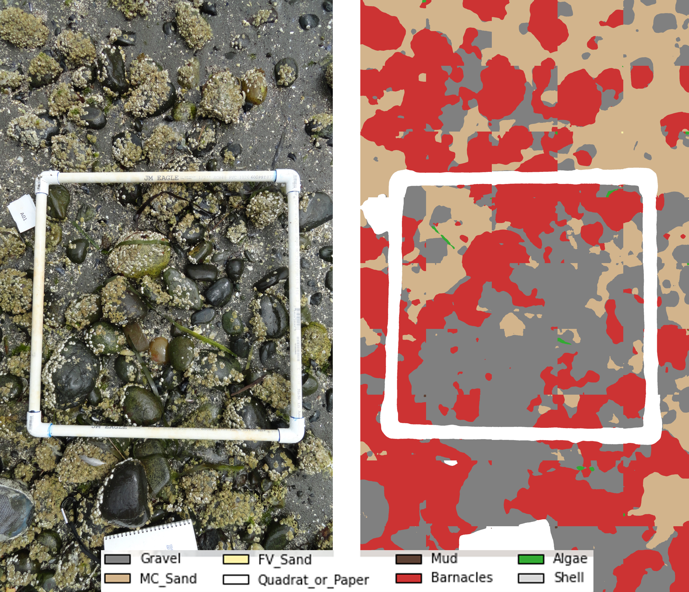
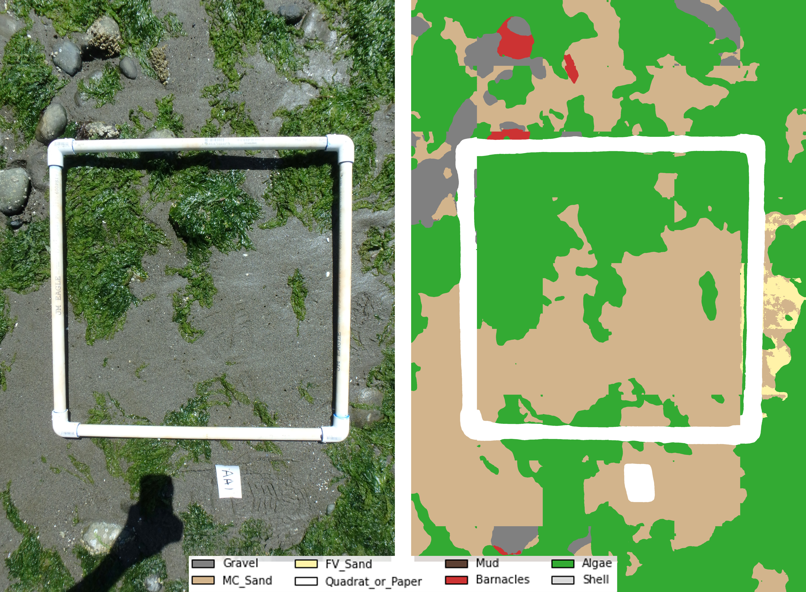
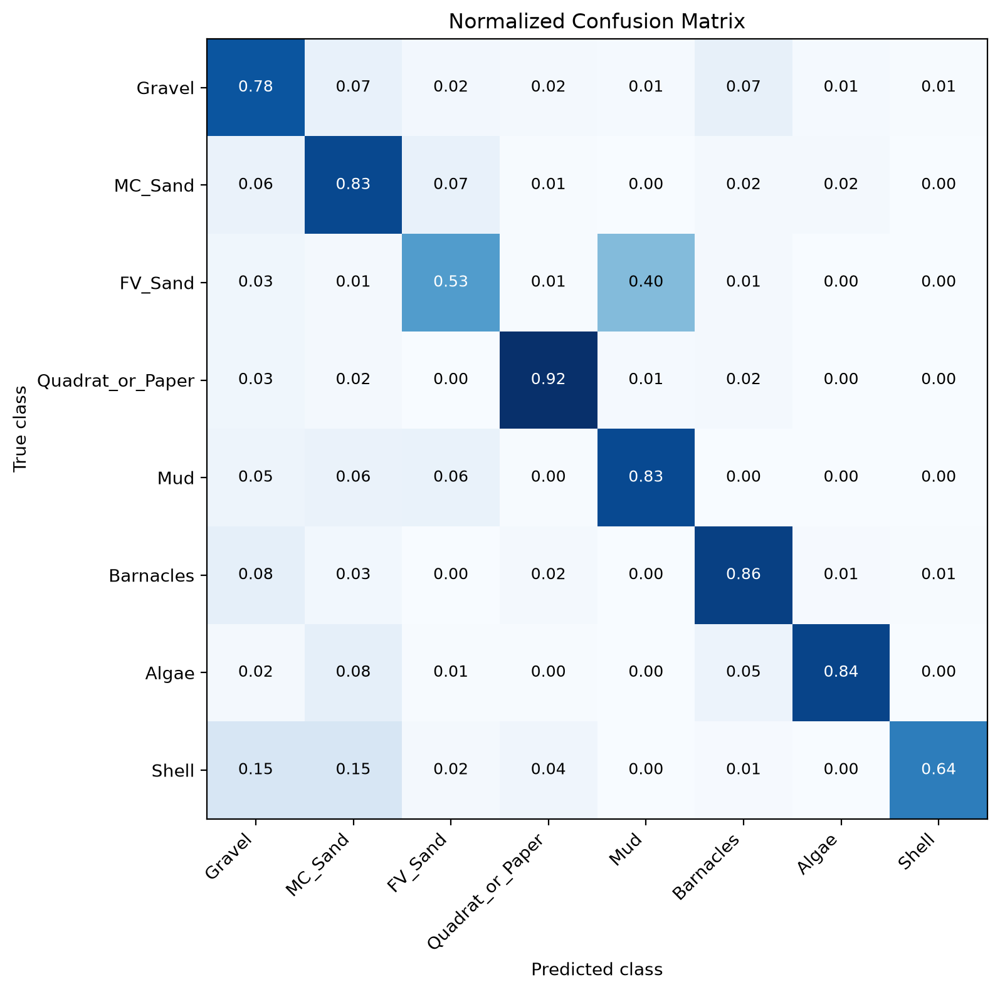

# Beach Photo Classifier

This project uses a **SegFormer semantic segmentation model** to classify intertidal substrate types and calculate substrate percent cover from handheld photographs of mixed-sediment beaches.

Training data were processed using Dan Buscombe's supervised image segmentation tool, [Doodler](https://github.com/Doodleverse/dash_doodler).

## Using the Pre-Trained Model

`Classify_Photos.py` can be used to classify the sample imagery or your own imagery, using the existing pre-trained [model weights](https://github.com/HornerL/beach_photo_classifier/releases/tag/v1.0.0). This model is still in production and is better at classifying some substrate types than others. 

## Training Your Own Model

To train a SegFormer model using your own training images and segmentation masks:

1. Use `TrainModel.py` to train the model.
2. Use `EvaluateModel.py` to evaluate model performance.

The dataset structure and class definitions used by the training and evaluation scripts are contained in `DefineDataset.py`.

## Example Classification

Examples of input photograph and the corresponding substrate classification produced by the trained model.

Confusion matrix showing model skill at identifying the various classes. Current iteration of model suffers from not enough training imagery of fine sand and mud, and struggles to distinguish between them.

